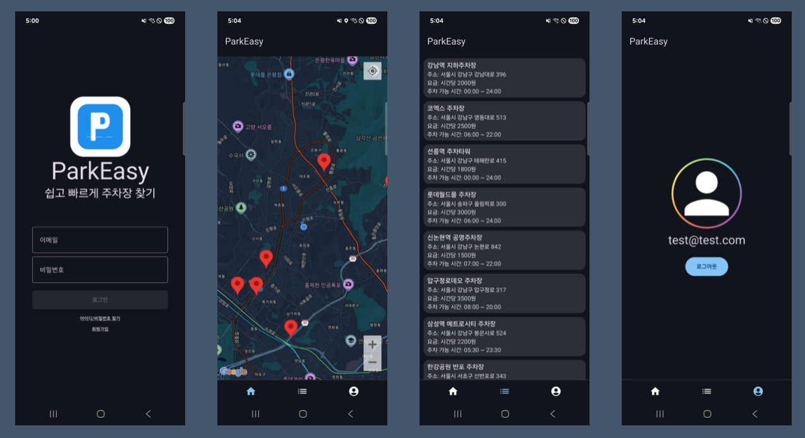

# ParkEasy

> 빠르고 편리한 주차장 정보 안내 서비스

ParkEasy는 사용자의 현재 위치를 기반으로 주변 주차장 정보를 실시간으로 제공하는 Android 애플리케이션입니다.
**Jetpack Compose**, **Clean Architecture**, **Multi-Module** 구조를 학습하고 적용하기 위해 개발 중인 프로젝트입니다.

[](https://kotlinlang.org)
[](https://developer.android.com/jetpack/compose)
[](https://developer.android.com/about/versions/10)

---

## 목차

- [주요 기능](#주요-기능)
- [기술 스택](#기술-스택)
- [프로젝트 구조](#프로젝트-구조)
- [화면 구성](#화면-구성)
- [설치 및 실행](#설치-및-실행)
- [개발 문서](#개발-문서)

---
## 스크린샷



## 주요 기능

### 인증
- Firebase Authentication 기반 이메일 로그인/회원가입

### 홈 화면
- **Google Maps** 기반 실시간 지도 표시
- 사용자 현재 위치 자동 감지 (Fused Location API)
- 주변 주차장 마커 표시
- 위치 권한 관리 (Accompanist Permissions)

### 주변 주차장 목록
- 현재 위치 기준 주변 주차장 리스트 뷰
- 주차장 정보 제공:
  - 시간당 요금
  - 운영 시간 (시작/종료)
  - 실시간 주차 가능 공간
  - 주소 및 위치 정보

### 마이페이지 (MyPage)
- 사용자 프로필 정보 표시
- 로그아웃 기능


## 기술 스택

### 핵심 프레임워크
- **Kotlin**
- **Jetpack Compose**
- **Material Design 3**

### 아키텍처 및 패턴
- **Clean Architecture** - 계층 분리 및 의존성 역전
- **MVVM Pattern** - ViewModel + UiState/SideEffect
- **Multi-Module** - 4개 모듈 (app, presentation, domain, data)
- **Unidirectional Data Flow** - 단방향 데이터 흐름

### 주요 라이브러리

| 카테고리 | 라이브러리 | 버전 | 용도 |
|---------|-----------|------|------|
| **UI** | Jetpack Compose | 2024.09.00 | 선언형 UI 프레임워크 |
| **DI** | Hilt (Dagger) | 2.56.2 | 의존성 주입 |
| **Navigation** | Navigation Compose | 2.7.2 | 화면 네비게이션 |
| **Map** | Google Maps Compose | 4.4.1 | 지도 UI |
| **Location** | Play Services Location | 21.3.0 | 위치 서비스 |
| **Auth** | Firebase Auth | 34.3.0 | 사용자 인증 |
| **Async** | Kotlin Coroutines | 1.7.3 | 비동기 처리 |
| **Serialization** | kotlinx-serialization | 1.9.0 | JSON 직렬화 |

### 개발 환경
- **AGP (Android Gradle Plugin)**: 8.12.3
- **최소 SDK**: 29 (Android 10.0)
- **타겟 SDK**: 36 (Android 15.0)
- **컴파일 SDK**: 36
- **Java 버전**: 11

---

## 프로젝트 구조

### Clean Architecture + Multi-Module 구조


**의존성 규칙**:
1. **Presentation** → Domain만 의존 (Data 레이어를 직접 알지 못함)
2. **Data** → Domain만 의존 (인터페이스 구현)
3. **Domain** → 아무것도 의존하지 않음 (독립적인 비즈니스 로직)
4. **App** → 모든 모듈 조합 (DI 설정 및 앱 진입점)

### 주요 설계 원칙

- **단일 책임 원칙 (SRP)**: 각 모듈과 클래스는 하나의 책임만 가짐
- **의존성 역전 원칙 (DIP)**: 상위 계층이 하위 계층의 구현에 의존하지 않음
- **관심사의 분리 (SoC)**: UI, 비즈니스 로직, 데이터 처리 완전 분리


## 화면 구성

### 1. 로그인 화면 (LoginScreen)
- Firebase Authentication 기반 이메일 로그인
- 회원가입 화면으로 이동

### 2. 회원가입 화면 (SignUpScreen)
- Firebase Authentication 연동

### 3. 홈 화면 (HomeScreen)
- Google Maps 통합
- 현재 위치 자동 표시
- 주변 주차장 마커 표시
- 위치 권한 요청 및 관리

### 4. 주변 주차장 목록 (AroundListScreen)
- 주차장 리스트 카드 뷰
- 주차장 정보:
  - 이름
  - 시간당 요금
  - 운영 시간
  - 주소
  - 남은 주차 공간

### 5. 마이페이지 (MyPageScreen)
- 사용자 이메일 정보 표시
- 로그아웃 버튼

### Bottom Navigation
- 홈 (Home)
- 주변 주차장 (AroundList)
- 마이페이지 (MyPage)


## 설치 및 실행

### 1. 사전 요구사항

- **Android Studio**: Ladybug | 2024.2.1 이상
- **JDK**: 11 이상
- **최소 Android 버전**: Android 10 (API 29)

### 2. API 키 설정

#### Google Maps API Key
1. [Google Cloud Console](https://console.cloud.google.com/)에서 프로젝트 생성
2. Maps SDK for Android 활성화
3. API 키 생성
4. `local.properties` 파일에 추가:
   ```properties
   MAPS_API_KEY=YOUR_GOOGLE_MAPS_API_KEY
   ```

#### Firebase 설정
1. [Firebase Console](https://console.firebase.google.com/)에서 프로젝트 생성
2. Android 앱 추가 (패키지명: `com.example.parkeasy`)
3. `google-services.json` 다운로드
4. `app/` 디렉토리에 `google-services.json` 파일 배치

### 3. 프로젝트 클론 및 실행

```bash
# 프로젝트 클론
git clone https://github.com/yourusername/ParkEasy.git
cd ParkEasy

# Android Studio에서 프로젝트 열기
# 또는 Gradle을 통한 빌드
./gradlew assembleDebug

# 앱 실행
./gradlew installDebug
```

### 4. 빌드 및 실행

1. Android Studio에서 프로젝트 열기
2. Gradle 동기화 완료 대기
3. 에뮬레이터 또는 실제 디바이스 연결
4. Run 버튼 클릭 (▶️)
